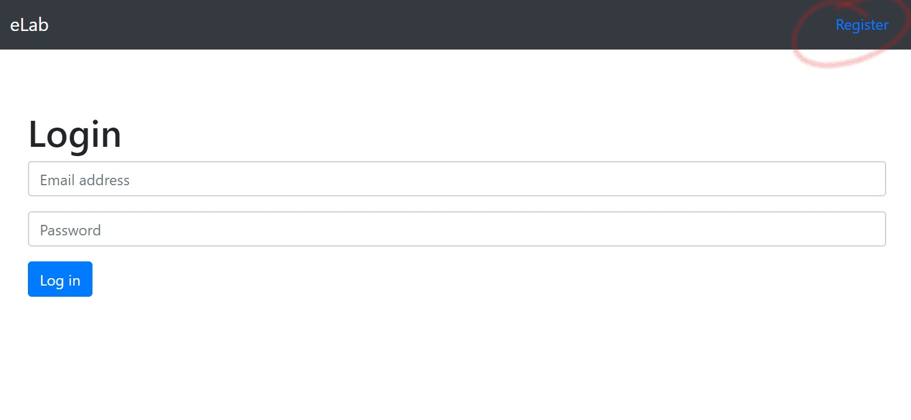
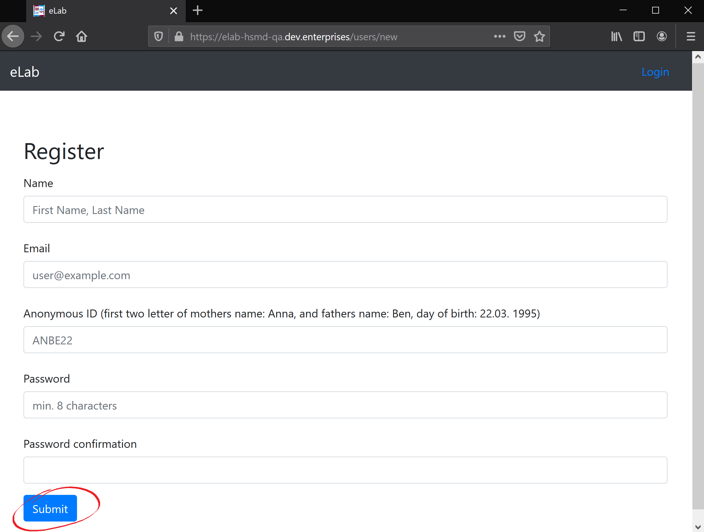
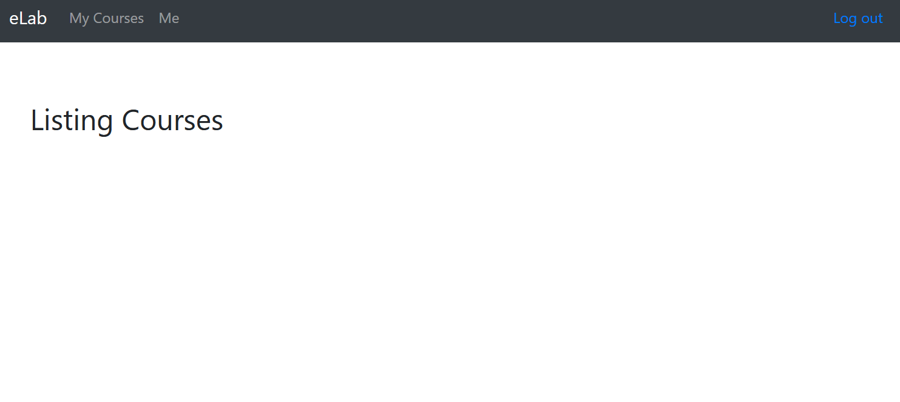
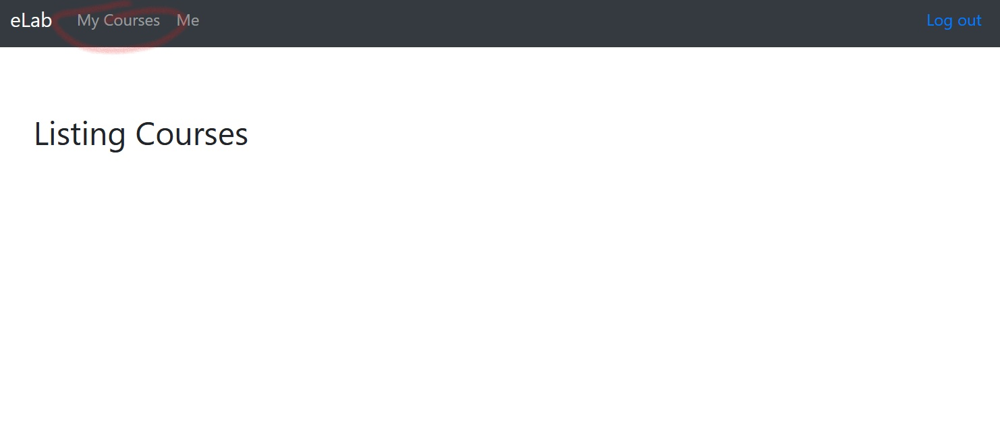
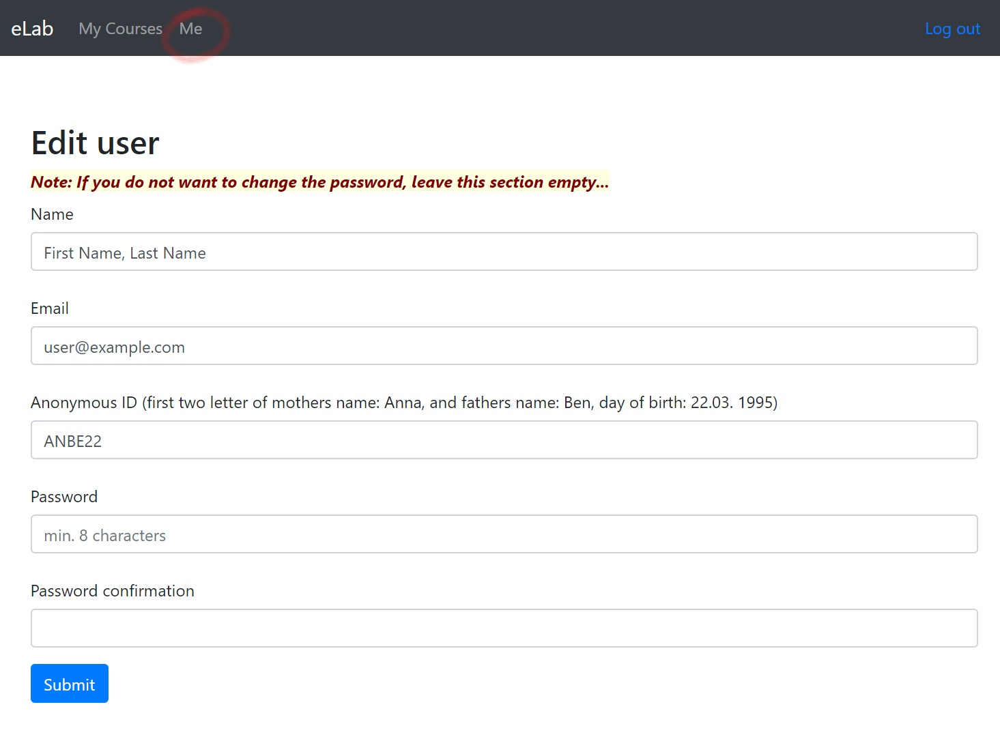

<!--

author:   Nancy Brinkmann, Ronny Stolze

email:    nancy.brinkmann@hs-magdeburg.de, ronny.stolze@hs-magdeburg.de

version:  1.0.0

language: de_DE

narrator: DE FEMALE

-->

# **Orientierungshilfe eLab**

Auf den folgenden Seiten wird das Arbeiten innerhalb der Webumgebung *eLab* erläutert und häufig auftretende Fragen geklärt. An dieser Stelle möchten wir Sie bitten, gern mit noch offenen Fragen auf uns zuzukommen, sodass auch diese hier möglichst schnell beantwortet werden können und somit alle nachfolgenden Nutzer noch mehr Unterstüzung finden. Vielen Dank!

 
**FAQ**

* [Was ist *eLab*?](#2)
* [Wie registriere ich mich?](#3)
* [Wie arbeite ich mit der Webumgebung *eLab*?](#4)
* [Wo finde ich die Kurse und wie trete ich ihnen bei?](#5)
* [Was passiert, wenn ich die Vorbereitungen abgeschlossen habe?](#6)
* [Was muss ich weiterhin beachten?](#7)

 
Datei 'Ablauf Praktikum' berücksichtigen!

## Was ist *eLab*?

Das Praktikum "Drehen" innerhalb des Moduls "Innovative Fertigungsverfahren" wird im Rahmen des
Projektes "Industrial e-Lab" neu angeordnet und somit zum "Praktikum Drehen mit Fernzugriff".

Vor dem Hintergrund der stärkeren Selbsttätigkeit und Orientierung an der Berufspraxis, besteht das Ziel des neu konzeptionierten Praktikums u.a. darin, Ihnen die Möglichkeit der weitestgehend eigenständigen Planung, Durchführung und Interpretation der Ergebnisse zu geben. Um diese Vorgehensweise zu gewährleisten, [registrieren](#3) Sie sich in der Webumgebung eLab. Mit diesem Zugang erhalten Sie zeit- und ortsunabhängigen Zugriff auf Lerninhalte, Kurse und sonstige Informationen das Praktikum betreffend.

## Wie registriere ich mich?

In Moodle stehen Ihnen zwei Links zum Praktikum *Drehen* zur Verfügung. Dem ersten Link sind Sie gefolgt und daher in dieser Orientierungshilfe gelandet. Der zweite Link führt Sie zur [Webumgebung *eLab*](https://elab-hsmd-qa.dev.enterprises/).

 
<!--
style = "width: 100%;
        border: 1px solid; "
-->

Hier klicken Sie rechts oben auf *Register* und geben in der folgenden Maske Ihre Nutzerdaten ein. Mit einem Klick auf *Submit* sind Sie als User gespeichert.

 
<!--
style = "width: 100%;
        border: 1px solid; "
-->

 

<!--
style="color: red;"
-->
Anmerkungen

<!--
style="color: red;"
-->
* Link zur Webumgebung aktualisieren, sobald uns eine eigene Domain zur Verfügung steht.
* bei AD nachfragen, ob und wie man sich als Nutzer löschen (lassen) kann. (Mindestens Admin?)

## Wie arbeite ich mit der Webumgebung *eLab*?

Die Webumgebung *eLab* wird Sie während der gesamten Zeit ihres Praktikums begleiten. Sie beinhaltet die Kurse, die Sie sowohl bei der Vorbereitung (Teil 1) für das Praktikum vor Ort, während der Versuche (Teil 2) als auch bei Ihren Nachbereitungen (Teil 3) unterstützen.

Nachdem Sie sich [registriert](#3) haben, finden Sie im Menü unter *eLab* die zur Verfügung stehenden Kurse. Um einem Kurs beizutreten, öffnen Sie diesen. Sie finden ihn von nun an im Menü unter *My Courses*.

 
<!--
style = "width: 100%;
        border: 1px solid; "
-->

 
**Vor dem Praktikum**

Mithilfe der Kurse können Sie sich inhaltlich (*Theoretische Grundlagen*) sowie praktisch (*Versuche*) auf das Praktikum vorbereiten und die für die Versuchsdurchführung benötigten Berechnungen anstellen. Sie haben weiterhin die Möglichkeit, sich mit der zu verwendenden Technik vertraut zu machen (*Maschinen- und Gerätetechnik*).

 
**Während des Praktikums/der Versuchsdurchführung**

Nachdem alle Vorbereitungen getroffen und Sie zu den Versuchen vor Ort zugelassen sind, tragen Sie sich jeweils für eine Laborzeit ein und führen die Versuche, weitestgehend selbstständig, durch. Ein Dozent wird Ihnen stets zur Seite stehen und Fragen beantworten. Im Labor haben Sie die Möglicheit, sich an einem Terminal mit Ihrem Account im *eLab* anzumelden und Ihre Daten aufzurufen. Die erhobenen Versuchsdaten können Sie vor Ort abspeichern.

 
**Nach dem Praktikum**

Nachdem Sie die Versuche durchgeführt und Ihre Daten erhoben haben, stehen diese Ihnen zeit- und ortsunabhängig zur Verfügung. Um das Praktikum abzuschließen, fassen Sie, unter Zuhilfenahme des Kurses *Protokoll*, Ihre Beobachtungen und Ergebnisse der Versuche zusammen und reichen diese innerhalb einer festgesetzten Frist mit dem Absenden-Button ein. Ihr Praktikum ist damit vollständig.

 

<!--
style="color: red;"
-->
Anmerkungen

<!--
style="color: red;"
-->
* Zunächst separaten Link zur Orientierungshilfe (in Moodle) bereitstellen. Ein weiterer Link zur Webumgebung.
* Vorher mit André sprechen, ob die Webumgebung so bleibt!
* Klären, wie der Absenden-Button heißt.
* Bild austauschen, sobald Kurse enthalten sind

## Wo finde ich meine Kurse?

Kurse, denen Sie einmal begetreten sind, finden Sie im Menü unter *My Courses*.

 
<!--
style = "width: 100%;
        border: 1px solid; "
-->

<!--
style="color: red;"
-->
Anmerkungen

<!--
style="color: red;"
-->
* Bild ändern, sobald Kurse eingepflegt sind.
* Mit AD klären, ob es möglich ist, die aktive Seite im Menü als solche zu markieren. (fett?)
* Klären, wie man aus den Kursen wieder austreten bzw. sich als Nutzer wieder löschen kann.

## Was passiert, wenn ich die Vorbereitungen zum Praktikum abgeschlossen habe?

Sobald Sie einen Kurs abgearbeitet und alle nötigen Eingaben wie Berechnungen getätigt haben, bestätigen Sie dies mit einem Klick auf *Submit*. Sobald Sie alle erforderlichen Kurse abgeschlossen und abgeschickt haben, erfahren Sie, ob Sie zum Praktikum zugelassen sind und erhalten Zugang zu den möglichen Praktikumszeiten im Labor. Dort tragen Sie sich für eine Zeit ein und absolvieren vor Ort vorzugsweise zu zweit den zweiten Teil des Gesamtpraktikums.

 

<!--
style="color: red;"
-->
Anmerkungen

<!--
style="color: red;"
-->
* Bild mit einem möglichen fertigen Kurs ergänzen. Submit-Button.
* Ist es möglich, jeweils zwei Studierende in eine Gruppe zu stecken? Oder müssen sie sich dann einen Nutzeraccount teilen?

## Weitere Hinweise

**Ändern des Passwortes**

Wenn Sie Ihr Passwort ändern möchten, gehen Sie im Menü auf *Me* und geben Ihr neues Passwort ein.

 
<!--
style = "width: 100%;
        border: 1px solid; "
-->
