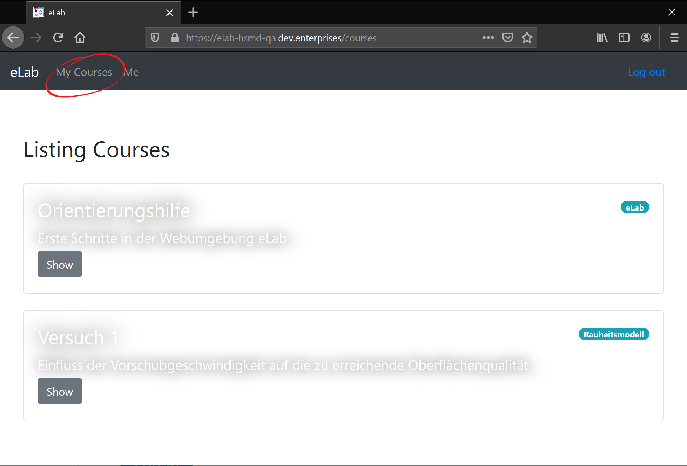

<!--

author:   Nancy Brinkmann, Ronny Stolze

email:    nancy.brinkmann@hs-magdeburg.de, ronny.stolze@hs-magdeburg.de

version:  1.0.0

language: de_DE

narrator: DE FEMALE

-->

# **Orientierungshilfe eLab**

Auf den folgenden Seiten wird das Arbeiten innerhalb der [Webumgebung eLab](https://elab-hsmd-qa.dev.enterprises) sowie praktikumsspezifische Vorgehensweisen erläutert und häufig auftretende Fragen geklärt. An dieser Stelle möchten wir Sie bitten, gern mit noch [offenen Fragen](#11) auf uns zuzukommen, sodass auch diese hier möglichst schnell beantwortet werden und somit alle nachfolgenden Nutzer noch mehr Unterstützung finden können. Vielen Dank!

 
**FAQ**

* [Was ist *eLab*?](#2)
* [Wie registriere ich mich?](#3)
* [Wie arbeite ich mit der Webumgebung *eLab*?](#4)
* [Wo finde ich die Kurse und wie trete ich ihnen bei?](#5)
* [Was passiert, wenn ich die Vorbereitungen abgeschlossen habe?](#6)
* [Hilfestellung Protokollerstellung](#7)
* [Allgemeine Hinweise](#10)

# Was ist *eLab*?

Das Praktikum "Drehen" innerhalb des Pflichtmoduls "Innovative Fertigungsverfahren" (5. Semester, WS, Vertiefungsrichtung Produktionstechnik) im Bachelorstudiengang Maschinenbau wird im Rahmen des Projektes "Industrial e-Lab" neu angeordnet und somit zum "Praktikum Drehen mit Fernzugriff".

Vor dem Hintergrund der stärkeren Selbsttätigkeit und Orientierung an der Berufspraxis, besteht das Ziel des neu konzeptionierten Praktikums u.a. darin, Ihnen die Möglichkeit der weitestgehend eigenständigen Planung, Durchführung und Interpretation der Ergebnisse zu geben. Um diese Vorgehensweise zu gewährleisten, [registrieren](#3) Sie sich bitte in der [Webumgebung eLab](https://elab-hsmd-qa.dev.enterprises). Mit diesem Zugang erhalten Sie Zugriff auf Lerninhalte, Kurse, Lernzielkontrollen und sonstige Informationen das Praktikum betreffend.

# Wie registriere ich mich?

Folgen Sie bitte dem Link, der Sie direkt zur [Webumgebung eLab](https://elab-hsmd-qa.dev.enterprises/) führt.

 
<!--
style = "width: 100%;
        border: 1px solid; "
-->

Hier klicken Sie rechts oben auf *Register* und geben in der folgenden Maske Ihre Nutzerdaten ein. Mit einem Klick auf *Submit* sind Sie als User gespeichert.

 
<!--
style = "width: 100%;
        border: 1px solid; "
-->

# Wie arbeite ich mit der Webumgebung *eLab*?

Die Webumgebung eLab wird Sie während der gesamten Zeit ihres Praktikums begleiten. Sie beinhaltet die Kurse, die Sie sowohl bei der Vorbereitung (Teil 1) für das Praktikum vor Ort, während der Versuche (Teil 2) als auch bei Ihren Nachbereitungen (Teil 3) unterstützen.

Nachdem Sie sich [registriert](#3) haben, finden Sie im Menü unter *eLab* die zur Verfügung stehenden Kurse. Um einem Kurs beizutreten, öffnen Sie diesen. Sie finden ihn von nun an im Menü unter *My Courses*.

 
<!--
style = "width: 100%;
        border: 1px solid; "
-->

 
**Vor dem Praktikum**

Mithilfe der Kurse können Sie sich inhaltlich (**Theoretische Grundlagen**) sowie praktisch (**Versuche**) auf das Praktikum vorbereiten und die für die Versuchsdurchführung benötigten Berechnungen anstellen. Einmal eingegeben und mit *Submit* bestätigt, sind diese gespeichert und können über Ihren Account eingesehen werden. So haben Sie auch im Labor Zugriff darauf. Sie haben weiterhin die Möglichkeit, sich im Vorfeld mit der zu verwendenden Technik vertraut zu machen (**Maschinen- und Gerätetechnik**). Die **Lernzielkontrolle** bietet Ihnen die Möglichkeit, Ihren aktuellen Wissensstand zu überprüfen.

 
**Während des Praktikums/der Versuchsdurchführung**

Nachdem Sie alle Voruntersuchungen bis zu einer festgesetzten Frist getätigt haben, gibt Ihnen Ihr Dozent die Information darüber, ob Sie zu den Versuchen vor Ort zugelassen sind. Sie bekommen nun die Möglichkeit, sich in Gruppen für Laborzeiten einzutragen und die Versuche weitestgehend selbstständig durchzuführen. Ein Dozent wird Ihnen stets zur Seite stehen und Fragen beantworten. Im Labor haben Sie die Möglicheit, sich mit Ihrem Account im [eLab](https://elab-hsmd-qa.dev.enterprises/) anzumelden und Ihre Daten aufzurufen. Die erhobenen Versuchsdaten können Sie vor Ort abspeichern.

<!--
style="font-size: 14px;"
-->
[*Anmerkung: Tun Sie sich bitte in Gruppen zusammen und einigen Sie sich, welchen Account der Mitglieder Sie nutzen möchten. Aus technischen Gründen ist es momentan leider nicht möglich, einer Gruppe einen Zugang zuzuordnen.*]

 
**Nach dem Praktikum**

Nachdem Sie die Versuche durchgeführt und Ihre Daten erhoben haben, stehen diese Ihnen zeit- und ortsunabhängig zur Verfügung. Um das Praktikum abzuschließen, fassen Sie unter **Protokoll** Ihre Beobachtungen und Ergebnisse der Versuche bis zu einer festgesetzten Frist zusammen. Ihr Praktikum ist damit vollständig.

# Wo finde ich die Kurse und wie trete ich ihnen bei?

Alle verfügbaren Kurse befinden sich in der [Webumgebung eLab](https://elab-hsmd-qa.dev.enterprises/) unter dem Menüpunkt *eLab*. Um einem Kurs beizutreten, öffnen Sie diesen. Kurse, denen Sie einmal beigetreten sind, finden Sie im Menü unter *My Courses*.

 
<!--
style = "width: 100%;
        border: 1px solid; "
-->

# Was passiert, nachdem ich die Vorbereitungen abgeschlossen habe?

Sobald Sie alle erforderlichen Kurse bis zu einer festgesetzten Frist abgeschlossen haben, werden Ihre Eingaben geprüft. Der Dozent sendet Ihnen eine Mail mit Informationen zu Ihrem Bearbeitungsstand und ggf. dem Zugang zu den möglichen Praktikumszeiten im Labor. Dort tragen Sie sich für eine Zeit ein und absolvieren vor Ort in Gruppen den zweiten Teil des Praktikums.

# Hilfestellung Protokollerstellung

Um das Praktikum abzuschließen, fassen Sie Ihre Beobachtungen und Ergebnisse der Versuche bis zu einer festgesetzten Frist zusammen. Die folgenden Seiten dienen als Hilfestellung zur Erstellung eines Protokolls innerhalb der Webumgebung.

## Visualisieren von Textdateien

Während der Durchführung der Versuche im Labor, werden Sie einige Textdateien ansammeln, die z.B. Daten zur Kraftmessung, Rauheitsmessung u.v.m. enthalten. Um diese ansehnlich in Ihr Protokoll einzubinden, haben Sie die Möglichkeit, sie zu visualisieren. So können Sie diese besser auswerten und als Bild in Ihr Protokoll einbinden. Eine kleine Anleitung der Vorgehensweise finden Sie hier.

Für jeden Versuch finden Sie im Protokoll den entsprechenden Platz für Ihre Auswertung und Interpretationen. Für die Auswertung der Kraftkurven z.B. sehen Sie folgendes Fenster:

<!--
style = "width: 100%; "
-->

Bitte kopieren Sie die Daten aus Ihrer zuvor generierten Textdatei in das Eingabefeld.

<!--
style = "width: 100%; "
-->

Ein Klick auf den blauen Pfeil links unter dem Feld verwandelt Ihre Daten in ein Diagramm. Dieses können Sie nun auswerten und sich als Bild herunterladen. Um einzelne Graphen auszublenden, klicken Sie auf das jeweilige Symbol in der Legende.

<!--
style = "width: 100%; "
-->

Wenn Sie weitere Daten einlesen möchten, löschen Sie die vorherigen Daten aus dem Eingabefeld, kopieren Ihre neuen Daten hinein und führen die Visualisierung wie oben beschrieben durch. Rechts unter dem Eingabefeld befinden sich Pfeile, mit Hilfe derer Sie zu allen zuvor eingegebenen Daten navigieren können. Für die neue Visualisierung ist jeweils ein Klick auf den blauen Pfeil links unter dem Eingabefeld notwendig.

## Hinweise

* Betätigen der Funktionstaste F5 aktualisiert die Seite und lässt alle Diagramme verschwinden. Ein erneuter Klick auf den Pfeil unter dem Eingabefeld erzeugt ein neues Diagramm.
* Um sich einen Ausschnitt im Diagramm näher anzuschauen, klicken Sie über dem Diagramm auf das Zoom-Icon und wählen den zu betrachtenden Bereich im Diagramm aus. Den Ausgangszustand erhalten Sie mit Zoom-Reset (Icon daneben).
* Wenn Sie erfahren möchten, welche Daten das aktuelle Diagramm beinhaltet, klicken Sie auf das Icon in Form eines Dokumentes.

# Allgemeine Hinweise

[Hilfe](#11)

[Passwort](#12)

[Kontakt](#13)

## Hilfe

~~Kommentare zu den Kursen~~

Wenn Sie uns etwas zu den Kursen mitteilen möchten (Hinweise, Probleme, Anregungen, ...), können Sie dies unter folgendem Pfad: My Courses -> Course -> Issues. Dort geben Sie im ~~Titel~~ den Namen des Kurses ein, zu dem Sie einen Kommentar los werden möchten, wählen den jeweiligen Typ aus und beschreiben kurz Ihr Anliegen.

## Passwort

~~Passwort ändern~~

Um Ihr Passwort zu ändern, gehen Sie im Menü auf *Me*, geben Ihr neues Passwort ein und bestätigen dieses.

 
<!--
style = "width: 100%;
        border: 1px solid; "
-->

 
~~Passwort vergessen~~

Wenn Sie Ihr Passwort vergessen haben, wenden Sie sich bitte per E-Mail an den Dozenten bzw. an [Nancy Brinkmann](#13) oder [Ronny Stolze](#13). Sie bekommen in diesem Fall ein Einmalpasswort, das Sie nach oben beschriebener Anleitung ändern können.

## Kontakt

Nancy Brinkmann  
E-Mail: nancy.brinkmann(at)h2.de

Ronny Stolze  
E-Mail: ronny.stolze(at)h2.de
